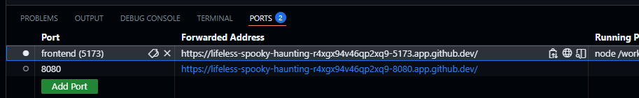

# interview-environment
This is the starting point for a CollegeBoard interview.

# Getting Started w/ GitHub Codespaces(Recommended)
This repo is configured to start a Codespace that's a ready-to-use enviornment.

1. Fork this Repo
2. Open your fork in a GitHub Codespace (Click "Code" > "Codespaces" > "Create a codespace on main")
3. Dependencies should be automatically installed when environment builds
4. Port forwarding is already configured.
5. Run `npm run dev:all` to start the frontend and backend together.
6. Open the frontend at `https://<your workspace name>-5173.app.github.dev/`
    * Alternatively: You can find the URL in the "Ports" Tab of VS Code, labeled "frontend" 

# Getting Started Locally
This repo has been tested in Codespaces, but should work in a local Linux-based environment with Node v22.16.0.

# Repo Contents
This repo contains a rudimentary React app for the fictional TechAssist organization. The following basic features have already been implemented:

1. The app has basic navigation using React Router.
2. The app has a simple database implemented with SQLITE.
3. Forms to create "Volunteers" and "Projects" exist and are wired up to storage.

```
├── backend # Source code for an Express server
├── frontend # Source code for a React app
├── package.json # Dependencies for ^
├── README.md
├── tsconfig.json # Typescript config
└── vite.config.ts # Vite Config
└── ...
```
